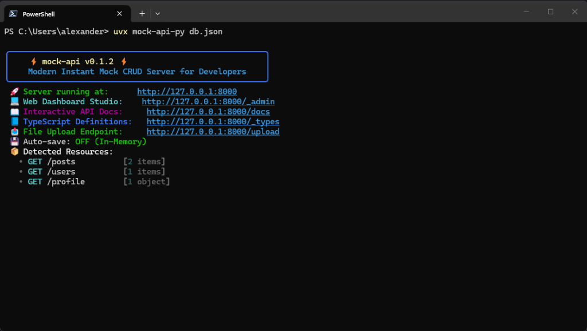
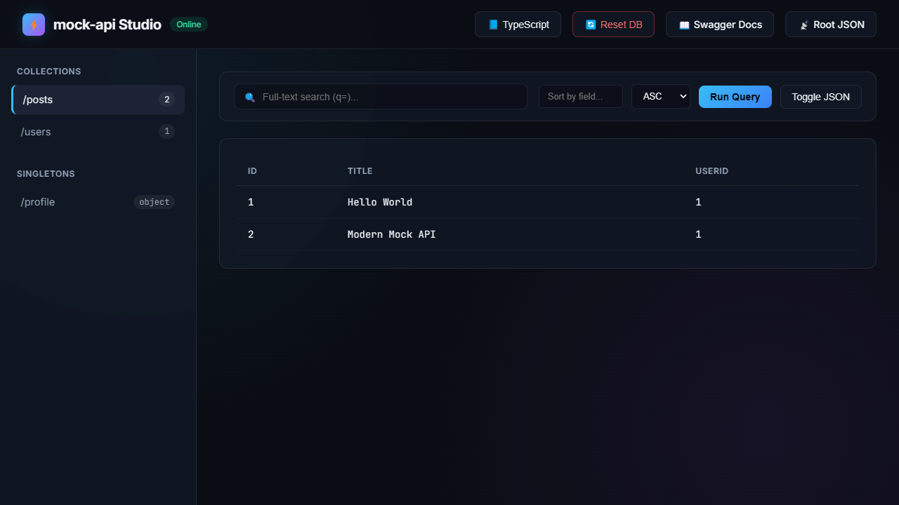
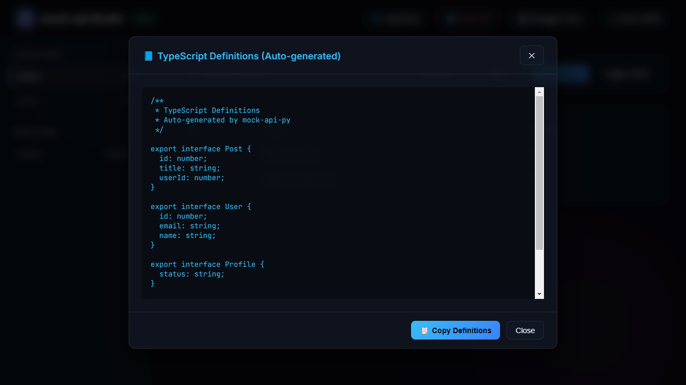
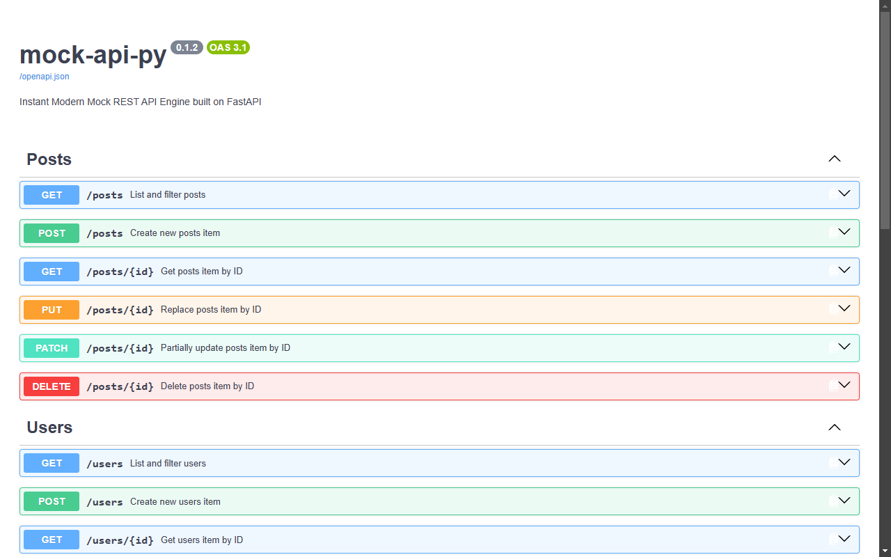

<p align="center">
  
</p>


<h1 align="center">⚡ mock-api-py (fastmock)</h1>

<p align="center">
  <a href="https://pypi.org/project/mock-api-py/"></a>
  <a href="https://github.com/alexandrmotologa/mock-api-py/actions/workflows/test.yml"></a>
  
  
  
</p>

<p align="center">
  <strong>Modern Instant Mock CRUD Engine with FastAPI, Rich CLI, and Chaos Testing.</strong><br>
  Spin up a full RESTful backend with filtering, sorting, pagination, and interactive Swagger documentation in under a second from a simple JSON file.
</p>

---

## 🚀 Why `mock-api-py`?

If you loved `json-server`, you will love `mock-api-py` even more:

- ⚡ **Lightning Fast**: Powered by ASGI and Uvicorn with async I/O.
- 📖 **Interactive Swagger UI**: Full OpenAPI docs automatically available at `/docs` and `/redoc`.
- 🎨 **Modern Console UX**: Styled Rich terminal output with detected resource tables and live-colored HTTP request logs.
- 🎲 **Built-in Chaos Engine**: Simulate realistic network conditions with latency jitter (`--delay 200-800`) and random 500 error injection (`--error-rate 0.1`) to test frontend resilience.
- 🔍 **Advanced Query Engine**:
  - Exact property filtering (`category=electronics&inStock=true`)
  - Comparative operators (`price_gt=25`, `price_gte=50`, `price_lt=100`, `price_lte=100`, `price_ne=29.99`)
  - Substring matching (`title_like=mouse`)
  - Full-text search across all object fields (`q=wireless`)
  - Multi-property sorting (`_sort=price&_order=desc`)
  - RFC-compliant pagination with `X-Total-Count` and `Link` headers (`_page=1&_limit=10`)
- 🔗 **Nested Relational Routes**: Automatically detects foreign keys (e.g. `userId` in `products` -> `GET /users/1/products`).
- 📘 **Auto TypeScript Generator**: One-click generation of fully-typed TypeScript interfaces for all collections (`GET /_types` and Studio viewer).
- 🔄 **Instant Database Reset**: Reset in-memory or persisted datasets back to initial boot state on-demand (`POST /_reset` or Studio button).
- 📤 **Mock File Uploads**: Upload images/documents via `POST /upload` with immediate static hosting at `/uploads/<filename>`.
- 🔌 **Smart Auto-Port Fallback**: Never crash due to a busy port; automatically finds and switches to the next free port.
- 🛡️ **Mock Authentication Engine**: Real HS256 JWT tokens, `/auth/login`, `/auth/register`, `/auth/me`, and bearer token protection on mutations (`--auth`).
- 🔀 **Custom URL Rewriter**: Map custom prefixes (`/api/*`), parameter aliases (`/articles/:id`), and query rewrites with `routes.json` (`--routes`).
- 💻 **Embedded Web Studio Dashboard**: Sleek dark-mode glassmorphic SPA at `/_admin` with live table/JSON views, search, query builder, TypeScript copy, and DB reset.
- 💾 **Safe Atomic Persistence**: In-memory speed by default with optional atomic write-back (`--save`) or strict `--read-only` mode.
- 👀 **Live Watch Mode**: Auto-reload in-memory data store when the JSON file changes on disk (`--watch`).
- 📁 **Static File Serving**: Serve static assets alongside mock APIs (`--static ./public`).

---

## 📦 Quickstart (Get Started in 5 Seconds)

You don't need to clone this repository, create virtual environments, or write a single line of code. Choose the method that best fits your workflow:

### 🌟 Method 1: Instant Zero-Install Run (Recommended via `uvx`)

If you have [`uv`](https://docs.astral.sh/uv/) installed (the modern, ultra-fast Python package runner, equivalent to `npx` in Node.js):

#### Option A: Run immediately without any files
```bash
uvx mock-api-py
```
> **What happens:** The server starts instantly with an in-memory starter database (`posts`, `users`, `profile`). No files are created on your disk!

#### Option B: Run with a JSON database file
```bash
uvx mock-api-py db.json
```
> **Magic Auto-Creation:** If `db.json` does **not** exist in your folder yet, `mock-api-py` will automatically create a starter `db.json` with sample data for you on the spot, and start the server immediately!

---

### 🤖 Method 2: Generate Realistic Synthetic Data with Faker

Want custom test data (e.g. 20 users, 50 products, 30 posts)?

```bash
# Step 1: Generate realistic dataset
uvx mock-api-py generate --output db.json --schema "users:20,products:50,posts:30"

# Step 2: Boot the server
uvx mock-api-py db.json
```

---

### 🐍 Method 3: Classic Installation via `pip`

If you prefer installing tools permanently into your Python environment:

```bash
pip install mock-api-py
```

Then run with any of the available command aliases from anywhere:
```bash
mock-api db.json
# or
fastmock db.json
# or
mock-api-py db.json
```

---

## 🖥️ What to Expect When You Run It

Once started, your terminal displays an aesthetic dashboard showing your active endpoints:

<p align="center">
  
</p>


Now open your browser:
- **Web Studio Dashboard**: [http://127.0.0.1:8000/_admin](http://127.0.0.1:8000/_admin)
- **Interactive Swagger Docs**: [http://127.0.0.1:8000/docs](http://127.0.0.1:8000/docs)
- **API Endpoint**: [http://127.0.0.1:8000/posts](http://127.0.0.1:8000/posts)

To stop the server at any time, simply press `Ctrl + C` in your terminal.

---

## 💡 Beginner FAQ & Troubleshooting

<details>
<summary><b>Q: What is <code>uvx</code> and how do I get it?</b></summary>

`uvx` is a tool runner bundled with [`uv`](https://github.com/astral-sh/uv), the extremely fast Python package manager from Astral. It works just like `npx` in the JavaScript ecosystem: it downloads the tool in an isolated sandbox and runs it immediately without cluttering your system.

To install `uv` on Windows, run in PowerShell:
```powershell
powershell -ExecutionPolicy ByPass -c "irm https://astral.sh/uv/install.ps1 | iex"
```
Or on macOS/Linux:
```bash
curl -LsSf https://astral.sh/uv/install.sh | sh
```
Or via pip:
```bash
pip install uv
```
</details>

<details>
<summary><b>Q: Where is <code>db.json</code> created or looked for?</b></summary>

The file is read from or created in the **current working directory** of your terminal (the folder path shown on the left of your terminal prompt).
</details>

<details>
<summary><b>Q: What if port 8000 is already in use by another app?</b></summary>

No problem! `mock-api-py` includes smart port hunting. It will detect that port 8000 is busy and automatically switch to the next open port (e.g., 8001) with a friendly notification in the console.
</details>

---

## 🛠️ CLI Usage & Flags

```bash
mock-api [DB_FILE] [OPTIONS]
```

### Options

| Flag | Short | Default | Description |
|------|-------|---------|-------------|
| `--port` | `-p` | `8000` | Port to bind the server to |
| `--host` | `-h` | `127.0.0.1` | Host address to bind |
| `--delay` | `-d` | `None` | Artificial latency in ms. Supports fixed (`300`) or jitter range (`200-800`) |
| `--error-rate` | `-e` | `0.0` | Random 500 error injection rate between `0.0` and `1.0` (e.g. `0.1` = 10%) |
| `--save` / `--write-back` | | `False` | Automatically persist POST/PUT/PATCH/DELETE mutations back to disk |
| `--read-only` | | `False` | Disallow all mutating HTTP methods (POST, PUT, PATCH, DELETE) |
| `--watch` | `-w` | `False` | Auto-reload in-memory database when the file is modified externally on disk |
| `--static` | | `None` | Directory to mount as static file server at `/static` |
| `--auth` | | `False` | Enable mock authentication and require JWT Bearer tokens for mutations |
| `--routes` | `-r` | `None` | Path to JSON custom routes rewriter file (e.g. `routes.json`) |

---

## 💻 Web Studio Dashboard (`/_admin`)

Access an interactive, modern dark-mode admin interface in your browser:
```
http://127.0.0.1:8000/_admin
```
Features:
- Live resource explorer showing all collections and singletons with real-time record counts.
- Instant full-text search (`q=`) and interactive sort controls.
- Single-click toggle between responsive data table and syntax-highlighted JSON viewer.
- **📘 TypeScript Modal**: Preview and copy auto-generated TypeScript interfaces with a single click.
- **🔄 Reset DB Button**: Revert the database back to its initial boot snapshot instantly.
- Direct links to Swagger OpenAPI documentation.

<p align="center">
  
</p>

---

## 📘 TypeScript Types Generator (`/_types`)

Frontend developers can instantly generate strict TypeScript models matching their mock database directly from the CLI or within the Web Studio modal:

<p align="center">
  
</p>

```bash
# Fetch directly from CLI or build scripts
curl http://127.0.0.1:8000/_types > src/types/api.ts
```

Example generated output:
```typescript
export interface User {
  id: number;
  name: string;
  email: string;
  role?: string;
}

export interface Product {
  id: number;
  title: string;
  price: number;
  category: string;
  inStock: boolean;
}

export interface Database {
  users: User[];
  products: Product[];
}
```

---

## 🔄 Instant Database Reset (`/_reset`)

Testing destructive flows like deleting items or wiping profiles? Reset the database to its exact server-boot state at any time:

```bash
curl -X POST http://127.0.0.1:8000/_reset
```

Or simply click the **"🔄 Reset DB"** button in the Web Studio (`/_admin`).

---

## 📤 Mock File Uploads (`/upload`)

Simulate avatar uploads, attachments, or image pickers without setting up S3 or local storage:

```bash
curl -F "file=@avatar.png" http://127.0.0.1:8000/upload
```

Response:
```json
{
  "url": "/uploads/avatar.png",
  "filename": "avatar.png",
  "size": 42150,
  "contentType": "image/png"
}
```
The file is immediately accessible at `http://127.0.0.1:8000/uploads/avatar.png`.

---

## 🔌 Smart Auto-Port Fallback

Never get frustrated by `Error: [Errno 48] Address already in use`. If port 8000 is occupied by another app (or another `mock-api` instance), the engine smoothly seeks the next available port (8001, 8002, etc.) and starts right up with an alert in the console:

```
⚠️  Port 8000 is busy. Auto-switched to available port 8001.
```

---

## 🛡️ Mock Authentication & JWT

Simulate token-based authentication workflows in your frontend:

```bash
mock-api db.json --auth
```

When `--auth` is enabled:
1. Public endpoints: `GET` collection requests and Swagger docs remain accessible.
2. Mutating endpoints (`POST`, `PUT`, `PATCH`, `DELETE`) require an `Authorization: Bearer <token>` header, returning `401 Unauthorized` if missing or invalid.
3. Authenticate and obtain tokens:
   - `POST /auth/login` with `{ "email": "alice@example.com", "password": "any" }`
   - `POST /auth/register` with `{ "name": "Charlie", "email": "charlie@example.com" }`
   - `GET /auth/me` with `Authorization: Bearer <token>`

---

## 🔀 Custom URL Rewriter

Rewrite API paths, map legacy endpoints, or add global prefixes using a `routes.json` file:

```bash
mock-api db.json --routes routes.json
```

**`routes.json`**:
```json
{
  "/api/*": "/$1",
  "/articles/:id": "/posts/:id",
  "/top-products": "/products?_sort=price&_order=desc"
}
```
Now:
- `GET /api/users` ➔ routes to `GET /users`
- `GET /articles/42` ➔ routes to `GET /posts/42`
- `GET /top-products` ➔ routes to `GET /products?_sort=price&_order=desc`

---

## 🎲 Chaos Engineering Examples

Test how your React, Vue, or mobile frontend handles flaky networks and server errors:

```bash
# Add fixed 500ms latency to every request
mock-api db.json --delay 500

# Simulate variable 3G mobile network (jitter between 200ms and 900ms)
mock-api db.json --delay 200-900

# Inject a 15% random failure rate to test Error Boundaries
mock-api db.json --error-rate 0.15

# Combine jitter, chaos errors, and auto-save
mock-api db.json --delay 100-400 --error-rate 0.1 --save
```

---

## 🤖 Synthetic Data Generation

Need test data immediately? Generate realistic datasets with Faker:

```bash
mock-api generate --output data.json --schema "users:20,products:50,posts:30,comments:100"
```

Then boot it right up:
```bash
mock-api data.json
```

Supported built-in schemas: `users`, `products`, `posts`, `comments`, `todos`, `companies`, plus generic custom names.

---

## 📡 REST API & Query Reference

Every route is automatically documented with interactive OpenAPI Swagger documentation at `/docs`:

<p align="center">
  
</p>

### Standard CRUD Endpoints
- `GET    /products` - List products with query filtering
- `GET    /products/1` - Get product by ID
- `POST   /products` - Create product (auto-generates unique ID)
- `PUT    /products/1` - Replace product
- `PATCH  /products/1` - Partially update product
- `DELETE /products/1` - Delete product

### Singleton Endpoints
- `GET   /profile` - Get singleton object
- `PATCH /profile` - Update singleton fields

### Query Parameters

| Feature | Example | Description |
|---------|---------|-------------|
| **Exact Filter** | `?category=electronics&inStock=true` | Filter by scalar attributes |
| **Greater Than or Equal** | `?price_gte=50` | Numeric or string comparison |
| **Less Than or Equal** | `?price_lte=100` | Numeric or string comparison |
| **Not Equal** | `?category_ne=furniture` | Exclude matching values |
| **Full-Text Search** | `?q=wireless` | Case-insensitive search across all fields |
| **Sort** | `?_sort=price&_order=desc` | Sort by field ascending or descending |
| **Pagination** | `?_page=1&_limit=10` | Returns items with `X-Total-Count` and RFC `Link` headers |
| **Nested Routes** | `GET /users/1/products` | Returns products belonging to `userId: 1` |

For detailed documentation, see [docs/api.md](docs/api.md).

---

## 🧪 Running Tests

```bash
# Create virtualenv and install dependencies
uv venv
uv pip install -e ".[dev]"

# Run full test suite
uv run pytest -v
```

---

## 📄 License

MIT © [Alexandr Motologa](LICENSE)
